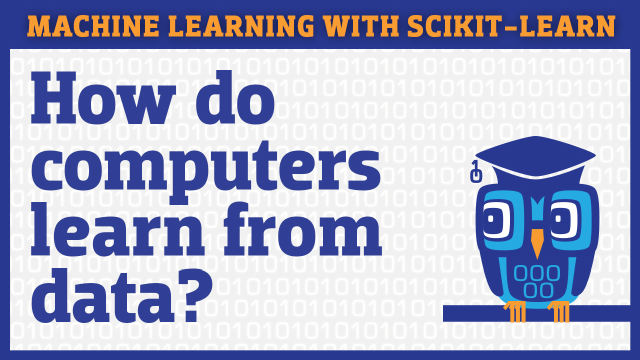

# Introduction to machine learning with scikit-learn

This video series will teach you how to solve machine learning problems using Python's popular scikit-learn library. There are **9 video tutorials** totaling 4 hours, each with a corresponding **Jupyter notebook**. The notebook contains everything you see in the video: code, output, images, and comments.

**Note:** The notebooks in this repository have been updated to use Python 3.6 and scikit-learn 0.19.1. The original notebooks (shown in the video) used Python 2.7 and scikit-learn 0.16, and can be downloaded from the [archive branch](https://github.com/justmarkham/scikit-learn-videos/tree/archive). You can read about how I updated the code in this [blog post](https://www.dataschool.io/how-to-update-your-scikit-learn-code-for-2018/).

You can [watch the entire series](https://www.youtube.com/playlist?list=PL5-da3qGB5ICeMbQuqbbCOQWcS6OYBr5A) on YouTube, and [view all of the notebooks](http://nbviewer.jupyter.org/github/justmarkham/scikit-learn-videos/tree/master/) using nbviewer.

Once you complete this video series, I recommend enrolling in my online course, [Machine Learning with Text in Python](http://www.dataschool.io/learn/), to gain a deeper understanding of scikit-learn and Natural Language Processing.

## Table of Contents

1. What is machine learning, and how does it work? ([video](https://www.youtube.com/watch?v=elojMnjn4kk&list=PL5-da3qGB5ICeMbQuqbbCOQWcS6OYBr5A&index=1), [notebook](01_machine_learning_intro.ipynb))
    - What is machine learning?
    - What are the two main categories of machine learning?
    - What are some examples of machine learning?
    - How does machine learning "work"?

2. Setting up Python for machine learning: scikit-learn and Jupyter Notebook ([video](https://www.youtube.com/watch?v=IsXXlYVBt1M&list=PL5-da3qGB5ICeMbQuqbbCOQWcS6OYBr5A&index=2), [notebook](02_machine_learning_setup.ipynb))
    - What are the benefits and drawbacks of scikit-learn?
    - How do I install scikit-learn?
    - How do I use the Jupyter Notebook?
    - What are some good resources for learning Python?

3. Getting started in scikit-learn with the famous iris dataset ([video](https://www.youtube.com/watch?v=hd1W4CyPX58&list=PL5-da3qGB5ICeMbQuqbbCOQWcS6OYBr5A&index=3), [notebook](03_getting_started_with_iris.ipynb))
    - What is the famous iris dataset, and how does it relate to machine learning?
    - How do we load the iris dataset into scikit-learn?
    - How do we describe a dataset using machine learning terminology?
    - What are scikit-learn's four key requirements for working with data?

4. Training a machine learning model with scikit-learn ([video](https://www.youtube.com/watch?v=RlQuVL6-qe8&list=PL5-da3qGB5ICeMbQuqbbCOQWcS6OYBr5A&index=4), [notebook](04_model_training.ipynb))
    - What is the K-nearest neighbors classification model?
    - What are the four steps for model training and prediction in scikit-learn?
    - How can I apply this pattern to other machine learning models?

5. Comparing machine learning models in scikit-learn ([video](https://www.youtube.com/watch?v=0pP4EwWJgIU&list=PL5-da3qGB5ICeMbQuqbbCOQWcS6OYBr5A&index=5), [notebook](05_model_evaluation.ipynb))
    - How do I choose which model to use for my supervised learning task?
    - How do I choose the best tuning parameters for that model?
    - How do I estimate the likely performance of my model on out-of-sample data?

6. Data science pipeline: pandas, seaborn, scikit-learn ([video](https://www.youtube.com/watch?v=3ZWuPVWq7p4&list=PL5-da3qGB5ICeMbQuqbbCOQWcS6OYBr5A&index=6), [notebook](06_linear_regression.ipynb))
    - How do I use the pandas library to read data into Python?
    - How do I use the seaborn library to visualize data?
    - What is linear regression, and how does it work?
    - How do I train and interpret a linear regression model in scikit-learn?
    - What are some evaluation metrics for regression problems?
    - How do I choose which features to include in my model?

7. Cross-validation for parameter tuning, model selection, and feature selection ([video](https://www.youtube.com/watch?v=6dbrR-WymjI&list=PL5-da3qGB5ICeMbQuqbbCOQWcS6OYBr5A&index=7), [notebook](07_cross_validation.ipynb))
    - What is the drawback of using the train/test split procedure for model evaluation?
    - How does K-fold cross-validation overcome this limitation?
    - How can cross-validation be used for selecting tuning parameters, choosing between models, and selecting features?
    - What are some possible improvements to cross-validation?

8. Efficiently searching for optimal tuning parameters ([video](https://www.youtube.com/watch?v=Gol_qOgRqfA&list=PL5-da3qGB5ICeMbQuqbbCOQWcS6OYBr5A&index=8), [notebook](08_grid_search.ipynb))
    - How can K-fold cross-validation be used to search for an optimal tuning parameter?
    - How can this process be made more efficient?
    - How do you search for multiple tuning parameters at once?
    - What do you do with those tuning parameters before making real predictions?
    - How can the computational expense of this process be reduced?

9. Evaluating a classification model ([video](https://www.youtube.com/watch?v=85dtiMz9tSo&list=PL5-da3qGB5ICeMbQuqbbCOQWcS6OYBr5A&index=9), [notebook](09_classification_metrics.ipynb))
    - What is the purpose of model evaluation, and what are some common evaluation procedures?
    - What is the usage of classification accuracy, and what are its limitations?
    - How does a confusion matrix describe the performance of a classifier?
    - What metrics can be computed from a confusion matrix?
    - How can you adjust classifier performance by changing the classification threshold?
    - What is the purpose of an ROC curve?
    - How does Area Under the Curve (AUC) differ from classification accuracy?

## Bonus Video

At the PyCon 2016 conference, I taught a **3-hour tutorial** that builds upon this video series and focuses on **text-based data**. You can watch the [tutorial video](https://www.youtube.com/watch?v=ZiKMIuYidY0&list=PL5-da3qGB5ICeMbQuqbbCOQWcS6OYBr5A&index=10) on YouTube.

Here are the topics I covered:

1. Model building in scikit-learn (refresher)
2. Representing text as numerical data
3. Reading a text-based dataset into pandas
4. Vectorizing our dataset
5. Building and evaluating a model
6. Comparing models
7. Examining a model for further insight
8. Practicing this workflow on another dataset
9. Tuning the vectorizer (discussion)

Visit this [GitHub repository](https://github.com/justmarkham/pycon-2016-tutorial) to access the tutorial notebooks and many other recommended resources.
